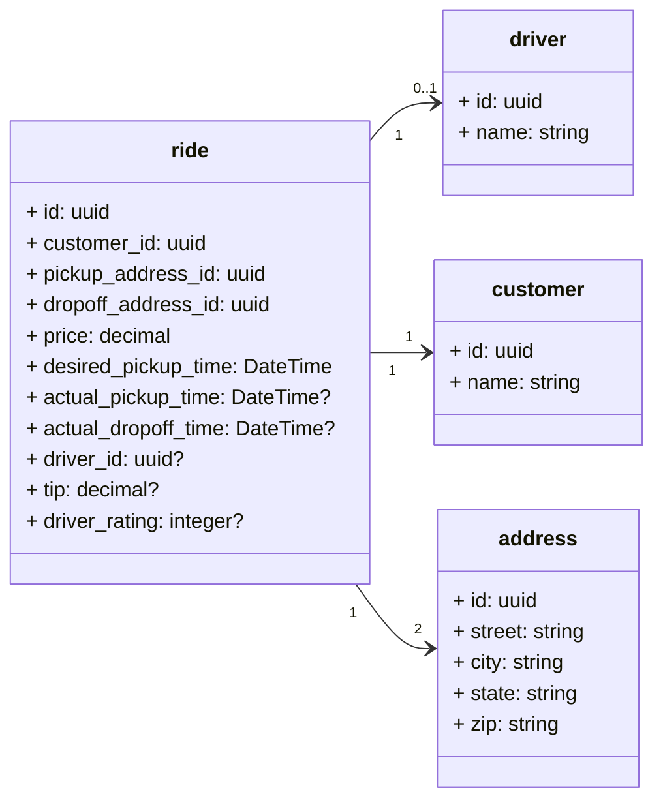

# Unter
## Simplified System Design


### Notes:
- entities would contain much more information, this is obviously just a simplified example
- `address`'s could be geolocations instead of formal addresses
    - would likely be "saveable" or "bookmarkable" for future use by the `customer`
- `ride` records are created when a `customer` SUBMITS a ride request
    - when a `ride` is created, all non-nullable columns must be populated
        - There should be validation and processing on the customers request before this record is allowed to be submitted
            - i.e.
                - `pickup_address_id` and `dropoff_address_id` must be different
                - `desired_pickup_time` must not be in the past
                - calculate the `price` based on the distance between the `pickup_address_id` and `dropoff_address_id`
                - etc
        - `customer_id` references the `customer` who submitted the ride request
        - `pickup_address_id` references the `address` where the `customer` wants to be picked up
        - `dropoff_address_id` references the `address` where the `customer` wants to be dropped off
        - `price` is the price the system calculated for the ride
        - `desired_pickup_time` is the time the `customer` wants to be picked up
    - when a `driver` ACCEPTS a ride request, the `driver_id` column is populated
    - when the `driver` PICKS UP a customer, the driver presses a button which sets the `actual_pickup_time` column
    - when the `driver` DROPS OFF a customer, the driver presses a button which sets the `actual_dropoff_time` column
        - once the ride is completed, the `customer` will get an optional popup to submit a `tip` and `driver_rating`
    - the `ride` is now considered complete

## Query: What drivers worked today (w/ aggregated data)?
> This will return a list of drivers who have completed at least one ride between the `start_of_time_search_param` and `end_of_time_search_param` parameters.
```postgresql
SELECT
	D.id,
	COUNT(R.id) AS ride_count,
	SUM(R.price) AS revenue,
	SUM(R.tip) AS tips,
	AVG(R.driver_rating) AS avg_rating
FROM driver D 
JOIN ride R
	ON R.driver_id = D.id
WHERE
	R.desired_pickup_time >= <<start_of_time_search_param>>
    AND R.desired_pickup_time <= <<end_of_time_search_param>>
GROUP BY D.id
```

## Query: Highest/Lowest rated driver?
> If the above query is not enough to easily determine the highest/lowest rated drivers in a given time frame, the below query will return a single driver based on the `sort_value` and between the `start_of_time_search_param` and `end_of_time_search_param` parameters.
- `sort_value` can be `ASC` or `DESC`
    - `ASC` will return the lowest rated driver
    - `DESC` will return the highest rated driver
```postgresql
SELECT
	D.*,
	AggRatings.rating
FROM (
	SELECT
		R.driver_id,
		AVG(R.driver_rating) AS rating
	FROM ride R
	WHERE
        R.driver_rating IS NOT NULL
        AND R.desired_pickup_time >= <<start_of_time_search_param>>
        AND R.desired_pickup_time <= <<end_of_time_search_param>>
	GROUP BY R.driver_id
) AggRatings
JOIN driver D
	ON D.id = AggRatings.driver_id
ORDER BY
	AggRatings.rating <<sort_value>>
LIMIT 1
```


# Bonus: How would you support rating customers?
I would add a `customer_rating` column to the `ride` table. Drivers would then be able to optionally rate their customers after a ride is completed. This would function almost identically to the way I described rating drivers.